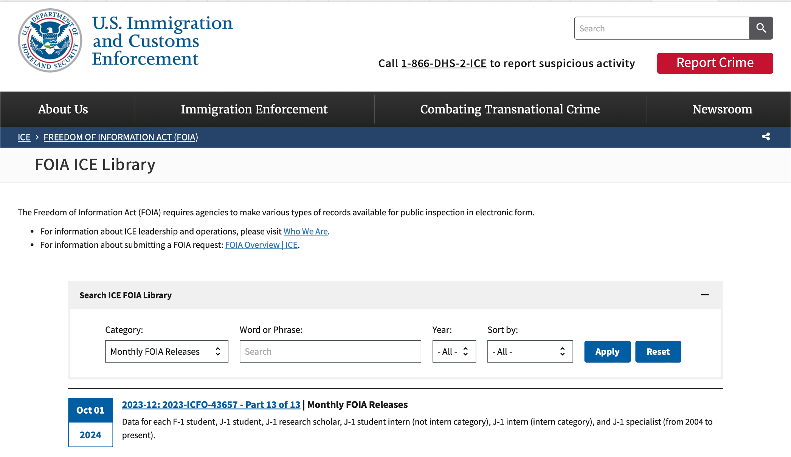
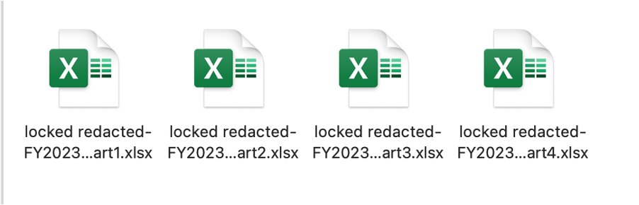
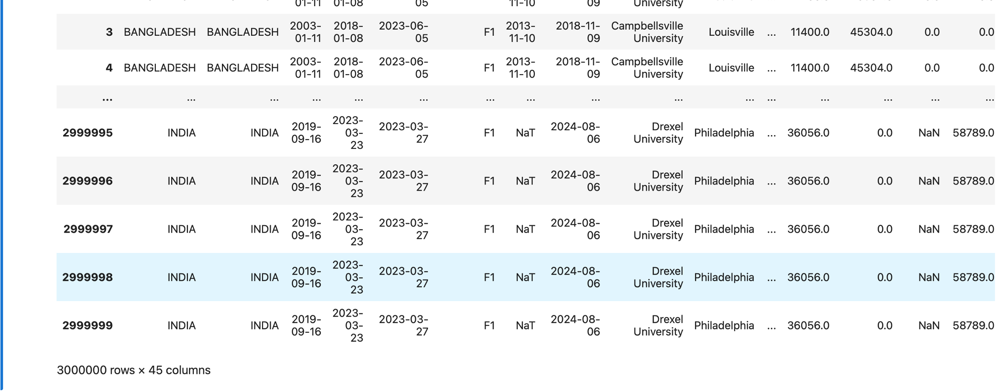
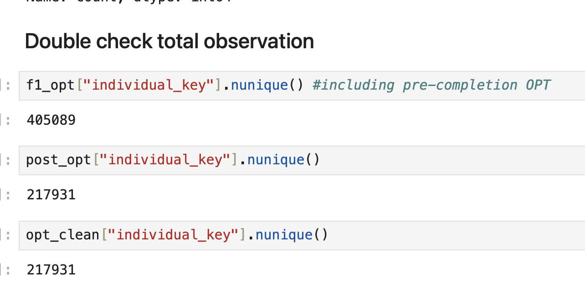
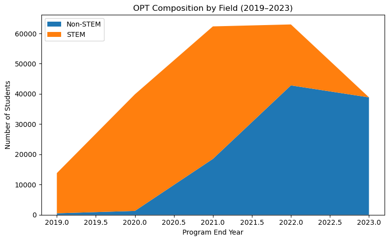
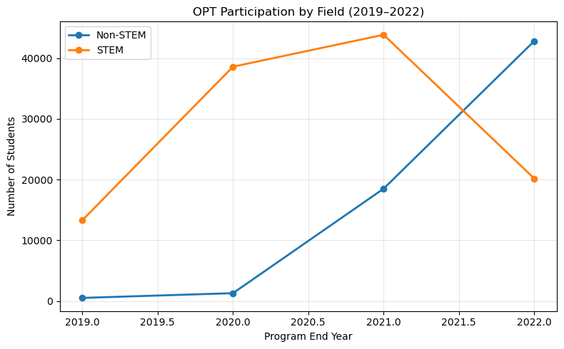
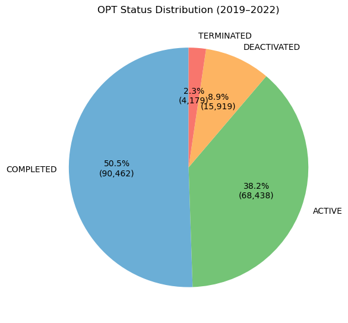
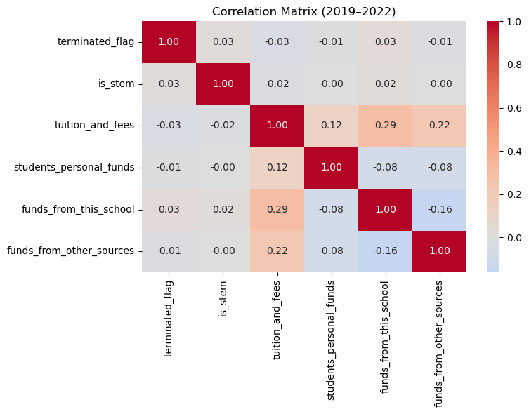
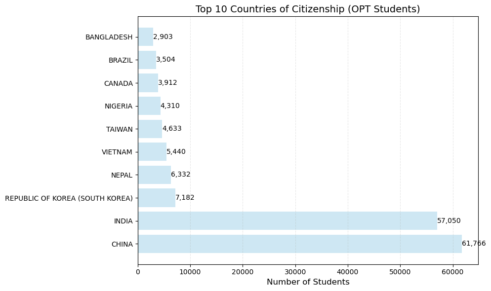
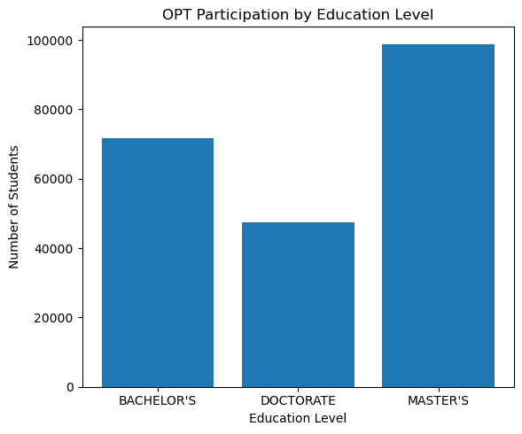

background-image: url("Slide12.png")
background-size: cover
background-position: center
class: center, middle

  

    OPT Outcomes (2019–2022)
  

  

    DATA 400 Mini Project
  

  

    Camela Phung
  

<!-- first slide -->

---
background-image: url("Slide4.png")
background-size: cover
background-position: center
class: middle

  <h2 style="font-size: 40px; margin-bottom: 40px; border-left: 8px solid; padding-left: 20px;">
    Research Questions
  </h2>
  
  <ul style="font-size: 26px; line-height: 1.6; padding-left: 20px;">
    <li style="margin-bottom: 25px;">
      What student characteristics are associated with <strong>OPT termination</strong> (2019–2022)?
    </li>
    <li style="margin-bottom: 35px;">
      Does <strong>field of study</strong> or <strong>STEM designation</strong> matter?
    </li>
  </ul>

  

    <strong>Methodological Note:</strong> Analysis isolates intrinsic student factors by holding work experience variables constant.
  

<!-- 2nd slide -->

---
background-image: url("Slide3.png")
background-size: cover
background-position: center
class: center, middle

  <h1 style="color: black; font-size: 48px; margin-bottom: 10px;">Data Retrieval & Processing</h1>
  
  

    <strong>Source:</strong> ICE FOIA Library (2023-ICFO-43657)
  

  

    
    
    
  

???

### Presentation Script (Rubric Alignment):

* **Data Retrieval (15%):** Data was retrieved directly from the ICE Freedom of Information Act (FOIA) Library, specifically release 2023-ICFO-43657. These are anonymized, individual-level records for F-1 international students.
* **Aggregation:** The process began by merging 13 distinct Excel parts (as seen on the slide) to create a single, comprehensive dataset covering records from 2004 to the present.
* **Tractability (15%):** To ensure the data was tractable and focused, I performed two key steps:
    1. **Time Filtering:** I isolated records with a `program_end_date` between 2019 and 2022 to analyze outcomes surrounding the pandemic period.
    2. **Feature Selection:** I intentionally dropped high-noise columns like "Employer Name" and "Salary". This allows us to hold work experience constant and focus on demographic and academic drivers.
* **Result:** This processed sample includes approximately 1.37 million records, providing a robust foundation for econometric analysis.

<!-- 3rd slide -->

---
background-image: url("Slide3.png")
background-size: cover
background-position: center
class: center, middle

  <h1 style="color: black; font-size: 48px; margin-bottom: 10px;">Cleaning & Processing</h1>
  
  

    <strong>Initial State:</strong> 3,000,000 rows (Raw FOIA Aggregation)
  

  

    
  

???

### Presentation Script (Rubric Alignment):

* **Data Retrieval (15%):** I retrieved individual-level records from the ICE FOIA Library, specifically the 2023-ICFO-43657 release.
* **Aggregation:** I merged 13 separate Excel parts to build this longitudinal dataset.
* **Tractability (15%):** The raw data initially contained 3,000,000 rows, many of which were duplicates or outside the target scope. To make the data tractable, I:
    1. **Deduplication:** Removed redundant records across the 13 merged files.
    2. **Filtering:** Focused on the 2019–2022 window, reducing the set to a manageable 1.37M records.
    3. **Feature Selection:** Dropped high-noise columns like "Employer Name" to hold professional experience constant.

<!-- 4th slide -->

---
background-image: url("Slide3.png")
background-size: cover
background-position: center
class: center

<h1 style="color: black; font-size: 48px; margin-bottom: 10px;">Total Observations</h1>

Narrowing the focus to unique Post-Completion OPT records

  

    <strong>Initial Unique IDs:</strong> 405,089 (Includes pre-completion OPT)
  

    <strong>Final Clean Sample:</strong> 217,931 unique international students
  

    Consistency: Verified unique ID counts across data states.
  

???
<!-- 5th slide -->

---
background-image: url("Slide3.png")
background-size: cover
background-position: center
class: center

???

### Presentation Script (Rubric Strategy):

* **Tractability (15%):** While the raw data spans from 2004 to the present, I intentionally limited this analysis to the **2019–2022** window. 
* **Data Volume:** Data for 2023 was excluded from the final trend analysis because the volume of recorded completions was significantly lower than previous years, which could skew the interpreted results.
* **Trend Observation:** As seen in the line chart, STEM participation peaked in 2021 before a moderate decline, while Non-STEM participation showed a steady, significant increase through 2022. 
* **Sample Integrity:** This 4-year window captures the primary shift in OPT participation during and immediately following the global pandemic, providing the most relevant data for current stakeholder implications.

<!-- 6th slide -->

---
background-image: url("Slide3.png")
background-size: cover
background-position: center
class: center

  <h1 style="color: black; font-size: 48px; margin-bottom: 10px;">Total OPT Status Distribution</h1>

  

    
    
    

        <li><strong>Risk Focus:</strong> The 2.3% "Terminated" rate (~4,179 records) provides the primary variance for our risk modeling.</li>
        <li><strong>Data Integrity:</strong> "Active" and "Deactivated" statuses are retained to ensure a comprehensive view of the 2019–2022 window.</li>
      </ul>
    

  

???

---
background-image: url("Slide3.png")
background-size: cover
background-position: center
class: top

  <h1 style="color: black; font-size: 48px; margin-bottom: 10px;">Correlation Heatmap</h1>

  

    

---
background-image: url("Slide3.png")
background-size: cover
background-position: center
class: top

  <h1 style="color: black; font-size: 48px; margin-bottom: 14px;">
    Geography
  </h1>

  

    

    

  

???
Explain:
- We show top countries to keep the chart readable.
- Avoid stereotyping: these are descriptive patterns, not causal.
- Small groups can look extreme; focus on big categories.

    
---
background-image: url("Slide3.png")
background-size: cover
background-position: center
class: top

  <h1 style="color: black; font-size: 48px; margin-bottom: 10px;">Educational</h1>

  

    
    
    
---
background-image: url("Slide3.png")
background-size: cover
background-position: center
class: top    

  <h1 style="color: black; font-size: 48px; margin-bottom: 10px;">By Degree Level</h1>
  
    

---
background-image: url("Slide3.png")
background-size: cover
background-position: center
class: top

  <h1 style="color: black; font-size: 38px; border-bottom: 2px solid #23373b; display: inline-block;">
    Stakeholders
  </h1>

  <ul style="font-size: 18px; line-height: 1.45; margin-top: 22px; width: 85%;">
    <li style="margin-bottom: 12px;">
      <strong>International students:</strong> Helps set expectations about OPT outcomes and highlights groups that may need stronger advising and compliance support.
    </li>
    <li style="margin-bottom: 12px;">
      <strong>Schools / DSOs:</strong> Identify patterns in terminations to improve communication, reporting reminders, and targeted workshops by major/region.
    </li>
    <li style="margin-bottom: 12px;">
      <strong>Employers:</strong> Encourages better compliance with OPT reporting timelines and STEM OPT requirements (e.g., E-Verify, evaluations).
    </li>
    <li style="margin-bottom: 12px;">
      <strong>Policymakers:</strong> Descriptive evidence can flag whether termination concentrates in specific groups, motivating audits of administrative barriers.
    </li>
    <li>
      <strong>Researchers:</strong> Builds a base for deeper work (adding job timelines, unemployment days, employer changes) to move from EDA to explanation.
    </li>
  </ul>

???
Talk track:
- This project is useful for advising + policy discussion, but must be communicated responsibly.

---
background-image: url("Slide3.png")
background-size: cover
background-position: center
class: top

  <h1 style="color: black; font-size: 38px; border-bottom: 2px solid #23373b; display: inline-block;">
    Societal, Legal, and Ethical
  </h1>
  
  <ul style="font-size: 18px; line-height: 1.45; margin-top: 22px; width: 85%;">
    <li style="margin-bottom: 12px;">
      <strong>Privacy & re-identification:</strong> Even with anonymized FOIA data, combining <em>country × major × school/state</em> can make small groups identifiable.
    </li>
    <li style="margin-bottom: 12px;">
      <strong>Fairness & stigma risk:</strong> Termination is rare (~2%), so subgroup rates can look extreme for small samples. Results should not be used to stereotype countries or majors.
    </li>
    <li style="margin-bottom: 12px;">
      <strong>Legal/regulatory context:</strong> “TERMINATED” may reflect reporting/compliance issues or SEVIS updates—not necessarily student effort or academic quality.
    </li>
    <li style="margin-bottom: 12px;">
      <strong>COVID cohort effects:</strong> 2020–2021 outcomes were shaped by pandemic labor-market shocks, so patterns may not generalize to other periods.
    </li>
    <li>
      <strong>Correlation ≠ causation:</strong> Financial indicators and termination risk are descriptive associations in EDA; causal claims require additional controls and design.
    </li>
  </ul>

???
Termination is weakly correlated with everything
	•	The correlation between termination_flag and all financial variables is between −0.03 and 0.03.
	•	That is extremely small.
	•	This suggests no strong linear relationship between financial capacity and termination.
-> Termination does not appear to be directly driven by tuition levels or funding sources.
- Being in a STEM field alone does not strongly predict termination in a simple linear sense.
- Financial variables are moderately correlated with each other:
	•	Higher tuition → more institutional or external funding.
	•	Students relying on personal funds rely less on school funding.

So the financial system structure is logical.
	•	Termination is likely driven by non-financial factors
	•	Possibly employment timing, reporting compliance, visa processing issues, or administrative factors

---
background-image: url("Slide3.png")
background-size: cover
background-position: center
class: center, middle

  Thanks for Listening!

